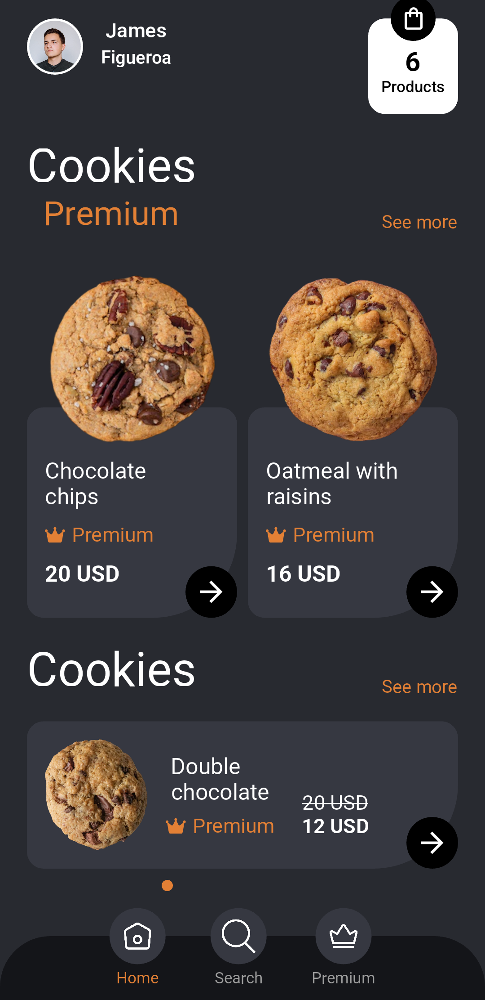

# Cookies

This Flutter app showcases a simple user interface for a cookie shop. While it is not a fully-fledged app with backend functionality, it provides a visually appealing representation of a cookie shop. The app displays a cart button, user information, and beautifully designed cards featuring various types of cookies.

## Screenshots




## Getting Started

Follow these steps to get the app running on your local machine:
Clone the repository:

```cmd
git clone https://github.com/hssaluja25/cookies-app.git
```

Navigate to the project directory:

```cmd
cd cookies-app
```

Run the app:

```cmd
flutter run
```
